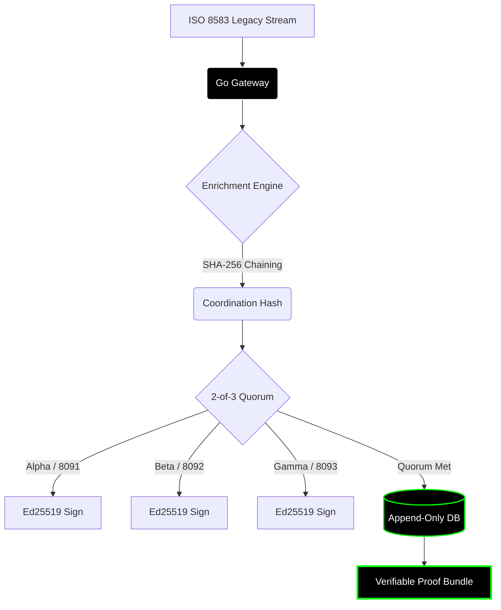
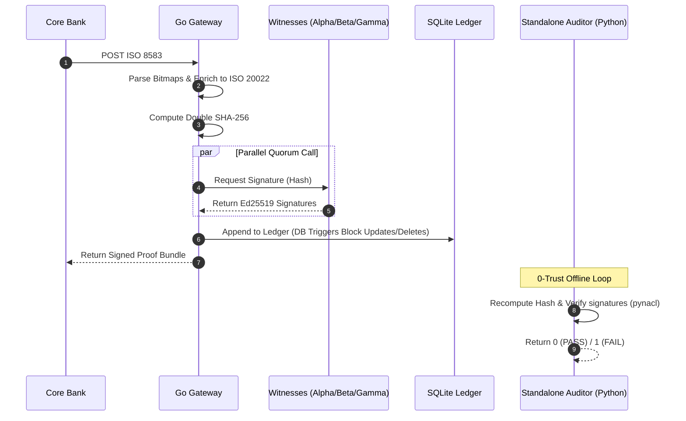

# Roy Chumba
**Systems Architect | Distributed Cryptographic Protocols**

<p align="left">
  <a href="https://git.io/typing-svg">
    
  </a>
</p>

---

## Live System Diagnostics

<table width="100%" border="0" cellpadding="0" cellspacing="0">
  <tr>
    <td width="50%" align="center">
      
    </td>
    <td width="50%" align="center">
      
    </td>
  </tr>
</table>

---

## CONNEX Protocol Topology

A process-isolated payment coordination layer translating legacy ISO 8583 message streams into validated, signed, and immutable ISO 20022 XML proof bundles.



---

## Transaction & Offline Audit Sequence



---

## Diagnostic Specifications

```text
+-----------------------+----------------------------------------------------+
| Metric                | Implementation Standard                            |
+-----------------------+----------------------------------------------------+
| Engine Runtime        | Go 1.22 (Parallel Concurrency)                     |
| Throughput            | ~350 Transactions Per Second (TPS)                 |
| Latency               | 28ms P99 (Zero Cloud Jitter)                       |
| Verification          | Stateless Ed25519 Multi-Signatures                 |
| Ledger Immutability   | SQLite Database Triggers (Strict UPDATE/DELETE ban)|
| Footprint             | < 15MB Static Binaries                             |
+-----------------------+----------------------------------------------------+
```

---
*Zero cloud dependencies. Zero trusted third parties. Hardened cryptographic proof.*
