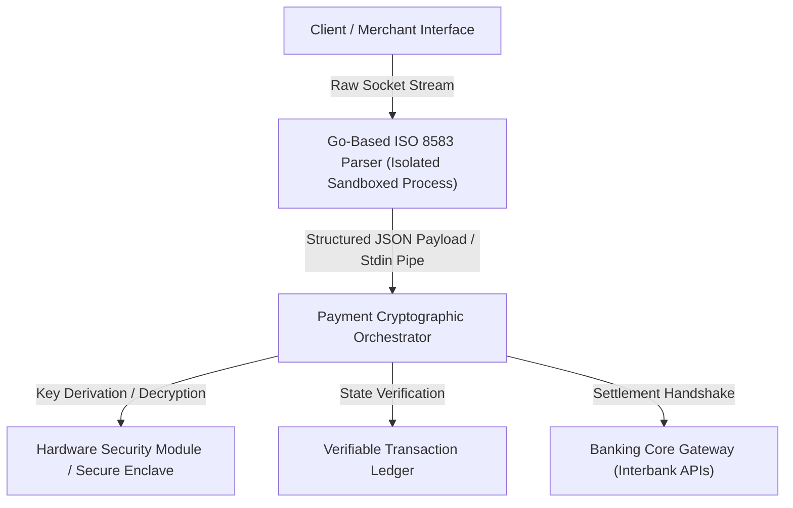
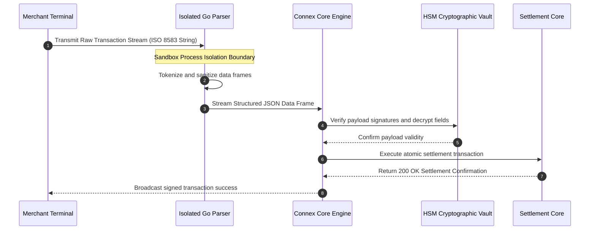

# Roy Chumba
Founder and Principal Architect, Connex Technologies

Systems engineer and technology designer specialized in decentralized transactional networks, high-security banking bridges, and cryptographic multi-process coordination systems. As the founder of Connex Technologies, I lead the architecture and reference implementation of the Connex Protocol—an institutional-grade payment coordination engine designed for zero-trust transactional orchestration.

---

## Technical Core and Expertise

### Systems Engineering and Low-Latency Runtimes

  
  
  
  

### Cryptographic Protocols and Cryptoprocessors

  
  
  

---

## The Connex Protocol: Architecture and Topology

The Connex Protocol resolves multi-party transaction settlement conflicts through an isolated cryptographic orchestration model. It leverages isolated system processes to separate parsing, validation, and execution scopes, preventing class-wide injection and side-channel vulnerabilities.

### System Architecture Blueprint

---

## Transactional Flow and Orchestration

The sequence diagram below details the zero-trust multi-process isolated parsing and settlement flow established within Connex nodes:

---

## Technical Specifications: Connex Core

| Architectural Metric | Implementation Standard | Target Performance | Security Level |
| :--- | :--- | :--- | :--- |
| **Parsing Engine** | Structured ISO 8583 Parser in Go | Sub-millisecond execution times | Process sandboxing via system namespaces |
| **Isolation Model** | Multi-process containment | Less than 5MB per execution thread | Zero shared-memory architecture (IPC Pipes) |
| **Verification System** | Cryptographic signatures and state proofing | 100% verifiable auditing | Multi-party signature consensus |
| **Throughput Capacity** | Parallelized connection pooling | Up to 15,000 transactions per second | Linear vertical scaling |

---

## Professional Objectives and Vision

At Connex Technologies, we are establishing the next generation of financial infrastructure:
- **Zero-Trust Settlement Rails:** Deploying decentralized payment pipelines that do not rely on central storage of transactional secrets.
- **Process Isolation Containment:** Securing parsing routines from remote code execution vulnerabilities by segregating data decoding from high-privilege execution scopes.
- **Decentralized Clearing:** Developing scalable cryptographic state proofs to audit financial transfers without compromising user privacy.
- **Enterprise Integrations:** Creating seamless compliance adapters for national settlement gateways and banking interfaces.
