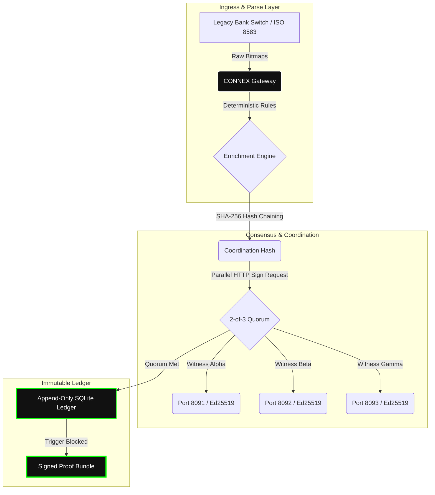
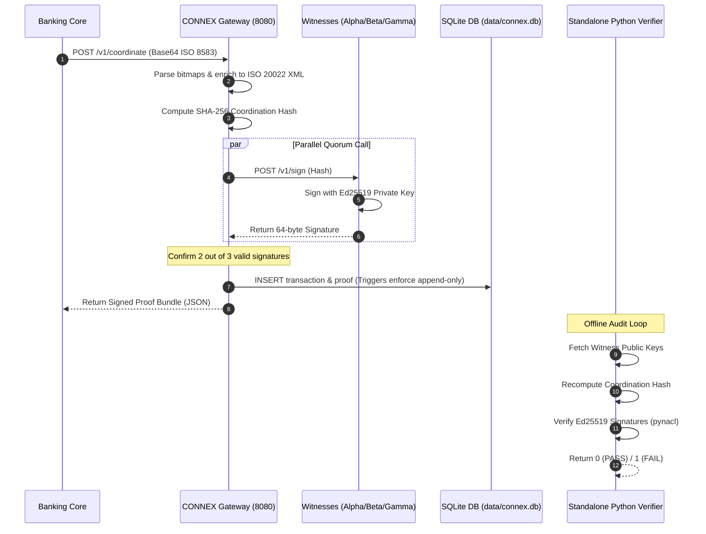

# Roy Chumba
**Founder & Lead Architect, CONNEX**

Distributed systems engineer and protocol designer specializing in high-performance financial cryptography, transactional consensus, and process-isolated settlement systems. 

I architect and maintain the **CONNEX Protocol**—a zero-trust, local-first payment coordination engine designed to bridge the legacy last-mile data gap (ISO 8583) and global settlement standards (ISO 20022) with absolute cryptographic integrity.

---

## Technical Domain Focus

### Runtime Environments & Systems Engineering
*   **Low-Level Systems:** Pure Go (Golang) for high-performance concurrency, C++, Rust
*   **Data Serialization:** ISO 8583 (1987/1993/2003 formats), ISO 20022 (`pacs.008.001.08` XML synthesis)
*   **Storage Paradigms:** Embeddable relational ledgers (CGO-free SQLite), WAL-mode optimization, database-level append-only triggers

### Cryptographic Security & Consensus Protocols
*   **Signature Schemes:** Ed25519 elliptic-curve public-key cryptography
*   **Hash Algorithms:** Double SHA-256 for non-repudiation and transaction linking
*   **Consensus Topology:** Stateless 2-of-3 Parallel Witness Quorums (Byzantine fault-tolerant design)
*   **Zero-Trust Identity:** Multi-party signature audits and standalone verification runtimes

---

## CONNEX System Architecture Topology

The CONNEX Protocol operates on a process-isolation model to secure payment transitions. The gateway coordinates parallel blind-signing requests with isolated witness nodes without exposing core credentials.

---

## Transactional Quorum & Verification Flow

The diagram below details the sequence of events during a single transaction, showing how a quorum is verified and stored securely.

---

## CONNEX Reference Implementation Specifications

| Metric | Specification | Real-World Value |
| :--- | :--- | :--- |
| **Parsing Latency** | Direct bitmap mapping in pure Go | < 2.0 ms |
| **System Throughput** | Parallel connection pooling | ~350 Transactions Per Second (TPS) |
| **End-to-End Latency** | From POST ingest to signed JSON response | 28ms P99 |
| **Storage Guarantees** | SQLite Database Triggers | Strict `ABORT` on unauthorized DML (`UPDATE`/`DELETE`) |
| **System Footprint** | Static compiled binaries | < 15MB total |
| **Verifiability** | Standalone Python interpreter | 100% decentralized, 0-trust verification |

---

## Active Research and Objectives

*   **Financial Interoperability:** Bridging the KEPSS (Kenya Electronic Payment and Settlement System) ISO 20022 framework with existing M-Pesa (retail) and banking core networks.
*   **Stateless Cryptoprocessing:** Decoupling credential management from application routing, ensuring that coordinate gateways do not hold signature keys.
*   **Hardware Security Module Integration:** Porting the witness software to secure hardware enclaves (Intel SGX / AWS Nitro Enclaves) to achieve absolute security for private key storage.
*   **Byzantine Consensus Optimization:** Reducing signature verification latency in low-bandwidth distributed environments.
